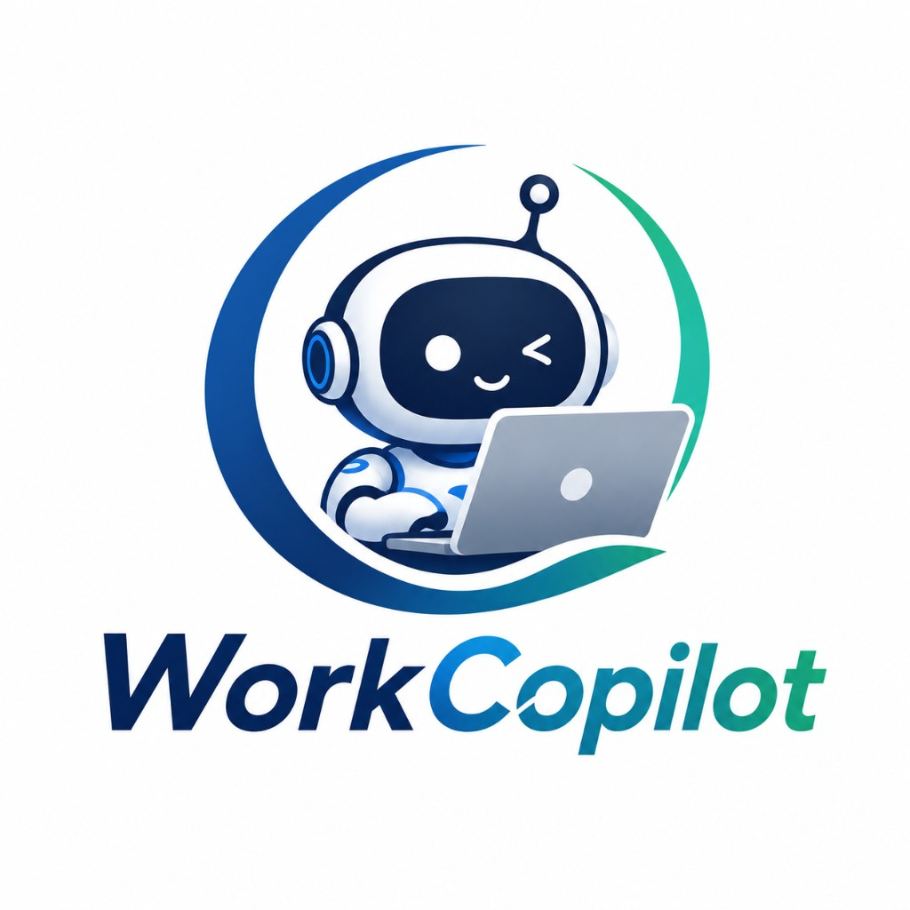

<p align="center">
  
</p>

# WorkCopilot

**v1.0.0** — 本机优先的个人工作助手。

用 **Chrome 扩展**做日常入口，用 **桌面端**托管本地 Runtime：把重复网页操作录成可回放工作流，把 Git 开发事实沉淀成日报 / 周报，把提醒交给本机后台——**释放双手，把时间留给思考与沉淀**。

数据与凭证默认留在本机（`~/.workcopilot`），不走云端同步。

---

## 怎么分工

| 组件 | 角色 |
|------|------|
| **Browser Agent**（Chrome 扩展） | 主入口：录制、执行、消息中心、日报 / 周报、聊天、轻量设置 |
| **Desktop Agent**（Tauri） | 启停 Runtime；设置 / AI 用量 / 项目 / 录制 管理台 |
| **AI Runtime**（`agent-core`） | 本地 `127.0.0.1` API：Workflow DSL、工具执行、凭证、Git / AI |

```text
Chrome Extension  ──HTTP + token──►  AI Runtime  ◄──启停──  Tauri Desktop
  录制 / 执行 / 日报 / 聊天           Workflow / Tools / SQLite      设置 / 扫库 / 用量
```

模型不直接生成可执行业务脚本；能力一律经 **Workflow DSL → Tool Registry** 落地。

---

## v1.0 功能

### 浏览器工作流
- 录制 click / input / 导航 / 多标签，生成可持久化的 Workflow DSL
- 密码不落明文：写入本地 credential，DSL 用 `credentialKey` 占位
- Playwright 本机回放；步骤间等待页面就绪
- **登录型**工作流：保存会话 Cookie；下次注入后若会话仍有效则跳过完整登录
- **应用型**工作流：按步骤完整回放
- 前置工作流串联：短流程组合，执行时自动跑前置链

### 信息抓取与消息中心
- 录制中「信息抓取」页面文本 → 执行时写入消息中心
- 定时触发工作流；内容变更产生未读提醒

### 日报 / 周报（开发工作记忆）
- 配置 Git 扫描目录，自动发现仓库并按日沉淀 commit / 变更事实
- **事实与 AI 分离**：先存原始 Markdown，再按需做日报分析、周 / 月汇总
- 扩展侧按月 → 自然周 → 日报浏览，可手写补充

### 扩展内对话
- Side Panel 聊天，连接本地 OpenAI 兼容模型（默认 DeepSeek）
- 经 Skill / 工具完成受控任务；不支持的话题有意图护栏

### 桌面管理台
| 模块 | 能力 |
|------|------|
| **设置** | Runtime Token、扫描目录、AI 模型、立即扫库 |
| **AI 用量** | 近 7 日调用次数与输入 / 输出字符量 |
| **项目** | 已扫描 Git 项目、快照与关联日报状态 |
| **录制** | 工作流 DSL 只读查看 + 原始 Recording |

### 安全底线
- Runtime 仅监听 `127.0.0.1`，Bearer Token 鉴权
- 凭证、Cookie、API Key 存 `~/.workcopilot/credentials/`，不进仓库

---

## 环境

- Node.js 22+
- pnpm 10+
- Rust 1.77+（Tauri）
- Chrome / Chromium

```powershell
pnpm install
pnpm db:generate
pnpm db:push
pnpm exec playwright install chromium
```

数据目录可用 `WORKCOPILOT_HOME` 覆盖。环境变量见 `.env.example`。

---

## 启动

**桌面端（推荐，会拉起 Runtime）：**

```powershell
pnpm --filter @workcopilot/desktop-agent tauri dev
```

**仅 Runtime：**

```powershell
pnpm runtime
```

监听 `127.0.0.1:4317`。首次启动生成 `~/.workcopilot/credentials/runtime.token.secret`，扩展与桌面 Settings 填入该 token。

**Chrome 扩展：**

```powershell
pnpm --filter @workcopilot/chrome-extension build
```

1. `chrome://extensions` → 开发者模式 → 加载 `apps/chrome-extension/dist`
2. Side Panel → Settings → 粘贴 runtime token → 连接

示例 DSL：`examples/workflows/`。

---

## 校验

```powershell
pnpm typecheck
pnpm test
pnpm build
```

---

## 包边界

| 包 | 职责 |
|----|------|
| `agent-core` | Hono API、编排入口 |
| `agent-skills` | 聊天 / 报告等 Skill |
| `workflow-engine` | 步骤生命周期 |
| `tool-registry` | Zod 校验工具分发 |
| `browser-recorder` | 录制事件 → DSL |
| `playwright-runtime` | **唯一**允许依赖 Playwright 的包 |
| `credential-provider` | 本地密钥 |
| `git-analyzer` / `memory-engine` | Git 事实与记忆辅助 |
| `model-provider` | 模型抽象 |
| `feishu-adapter` | 飞书相关（v2 对接预留） |

---

## Roadmap：v2

v1 聚焦本机闭环；下列能力放到 **v2**：

- **飞书 CLI / 飞书深度对接**（导出日报、消息出口等）
- **Qwen CLI** 及其他 CLI Agent 对接
- 云同步、多用户、企业账号
- 万能可视化 Workflow 编辑器
- 桌面内嵌聊天 / 桌面直接执行工作流（日常仍以扩展为主）
